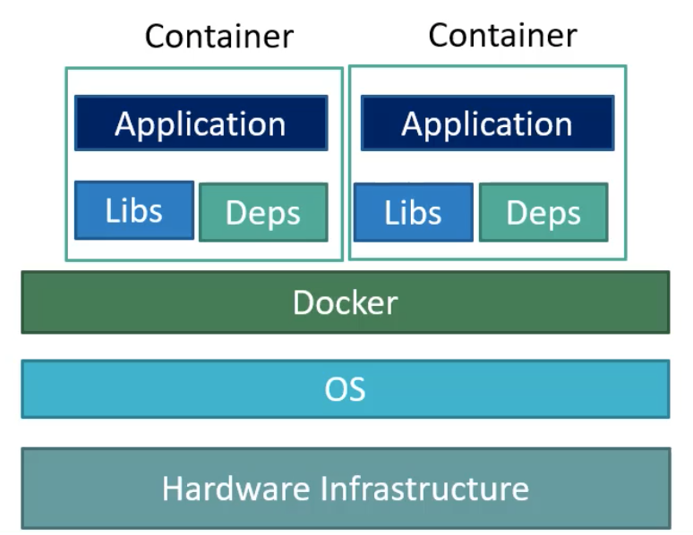
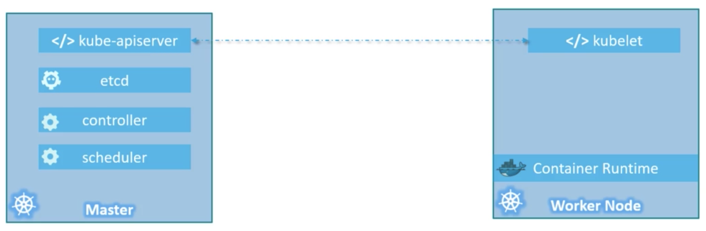

# Kubernetes Basics

## Overview

### Containers

- Completely isolated environment
- Different containers share the same kernel -> only containerize applications

- Instantiation of Docker Images, which easily resolve dependencies independently of the deployment environment
- Container orchestration
  - Process of automatically deploying and managing containers
  - ex) Docker Swarm, Kubernetes, Mesos

### Kubernetes Architecture

- Node
  - Worker machine where containers belong
  - Can be physical or virtual
  - We need more than one node in case of failure
- Cluster
  - A set of nodes
  - Multiple nodes enable applications to be accessible even when some of them fail, and distribute loads
- Master
  - Responsible of actual orchestration of nodes
- Components
  - API server
    - Frontend of Kubernetes
    - Provides APIs to interact with cluster
  - etcd
    - Distributed, reliable key-value store for information to manage cluster
  - Scheduler
    - Distributes work or containers across multiple nodes
  - Controller
    - Notices and responds when nodes go down
    - Determines to bring up new containers if necessary
  - Container runtime
    - Underlined software to run containers
    - ex) Docker
  - kubelet
    - Agent that runs on each node

